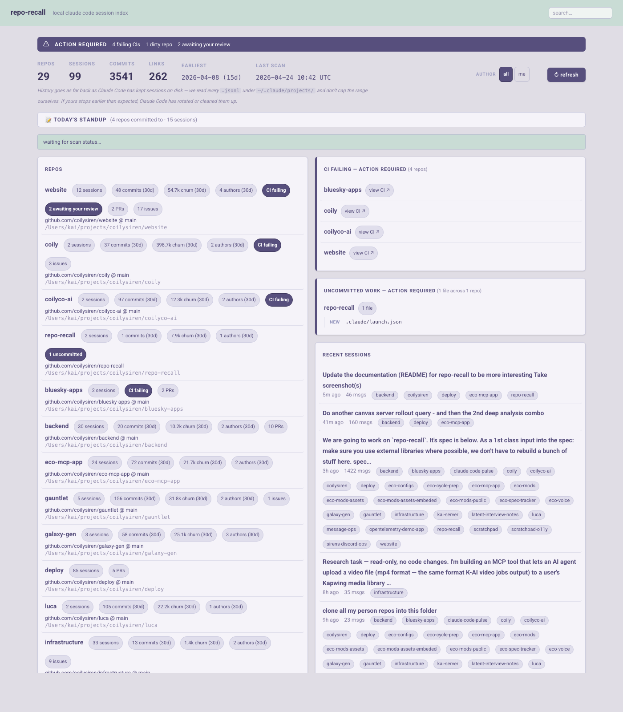
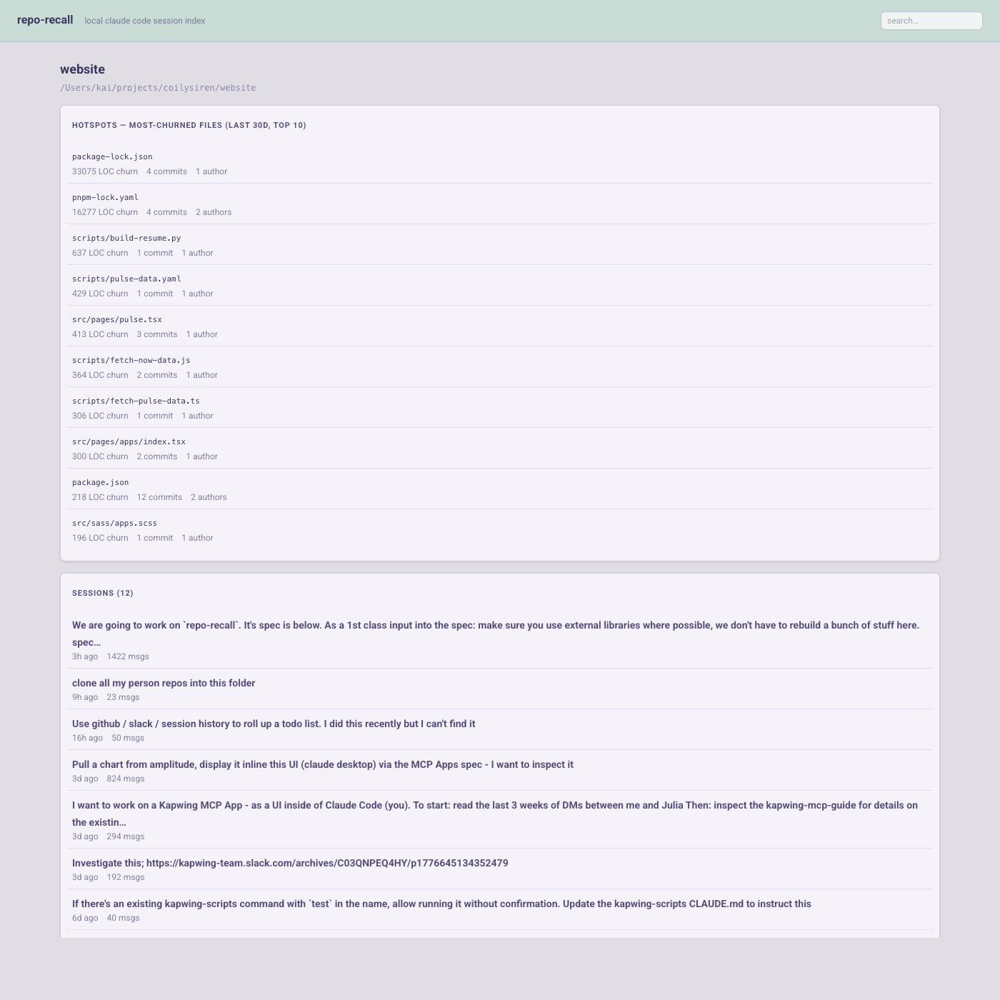
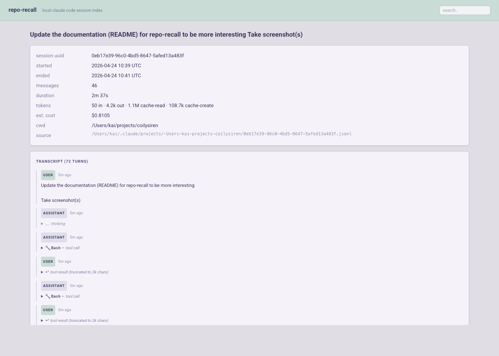

# repo-recall

> *"Wait — which Claude Code session was the one where I figured out the CI flake?"*

You've got dozens of repos on disk, hundreds of [Claude Code](https://claude.com/claude-code) sessions in `~/.claude/projects/`, and no way to connect the two. repo-recall is a tiny local web app that indexes both and joins them. Two questions, two clicks:

- **Which sessions touched this repo?** — open the repo, see every session that had it as `cwd`.
- **Which repos did this session touch?** — open the session, see every repo it crossed.

Everything is local. The server binds `127.0.0.1` only, and the cache lives in `$TMPDIR`. Outbound calls are limited to `gh run list` for CI status and (if you opt into push notifications) signed Web Push deliveries to FCM.



## What it actually shows you

**Dashboard** — every repo within N levels of where you launched it, ranked by a composite activity score. Per repo you get: session count, commits in last 30d, LOC churn, unique authors, open PRs/issues, CI status, and any `action-required` signal (failing CI, dirty working tree, mid-rebase). Failures sort to the top regardless of score, so a broken repo you haven't touched in a month still surfaces.

**Repo page** — the 10 hottest files by churn (great for "where's all the thrash actually happening?"), then every Claude Code session that had this repo as its `cwd`.



**Session page** — metadata (duration, message count, token usage, cost estimate) and a full transcript with collapsible tool calls.



## Point an agent at it

The same endpoints a browser hits are fine for an agent. Boot the server, hand a coding agent the local URL, and let it read the dashboard directly. repo-recall acts as a deterministic data aggregation layer: it does the repo walk, session parse, `git log` shell-outs, working-tree inspection, and CI fetch once, then serves a consistent structured view. The agent reasons over that snapshot instead of re-deriving the same joins with ad-hoc `grep` and `git log` calls every turn, and two agents asked the same question hit the same data.

The sweet spot is a broad prompt in auto mode — let the agent work through everything the dashboard flags without you babysitting each one. Copy-paste starters:

- `Open http://127.0.0.1:7777 and work through every repo flagged as action-required. For each one, investigate the cause and resolve it.`
- `Open http://127.0.0.1:7777. Find every repo with a dirty working tree and either commit or discard the changes, whichever is appropriate per repo.`
- `Open http://127.0.0.1:7777. Find every repo with failing CI on the default branch, diagnose the failure, and push a fix.`
- `Open http://127.0.0.1:7777. Review my recent Claude Code sessions and surface any in-progress work I left unfinished across repos.`
- `Open http://127.0.0.1:7777/repos/<id>. Look at the hottest files by churn and tell me what's driving the thrash.`

## For agents

The same URLs a browser hits also serve JSON. Send `Accept: application/json` (or append `?format=json`) to any of:

- `GET /` — the full dashboard projection: repos, banner counts, action-required items, recent sessions/commits, gh health, scan version.
- `GET /repos/{id}` — repo + sessions + commits + hotspots.
- `GET /sessions/{id}` — session metadata + linked repos + estimated cost.
- `GET /search?q=…` — partitioned hits (repos, sessions, commits).

Three endpoints exist purely for orchestrators that don't want HTML at all:

- `GET /api/action-required` — thin slice of just the action-required list. Each item carries `id = "<repo_id>:<signal>"` so you can tell "same broken thing, still broken" from "this one cleared and a different one appeared." Signals: `ci_failing`, `dirty_tree`, `in_progress_op`, `detached_head`, `review_requested`.
- `GET /api/scan-version` — single-integer poll target so you can ask "did anything change" without paying the JSON projection cost.
- `POST /api/refresh` — sync refresh. Awaits the scan, returns the new `scan_version`. Sibling of `POST /refresh`, which returns 202 and asks you to watch the WebSocket.

Every JSON response carries `ETag: "<scan_version>"`. Send `If-None-Match` on the next poll and you'll get `304 Not Modified` between scans for free.

The HTML repo-list cards also carry `data-repo-id`, `data-repo-name`, `data-action-required`, and `data-signals` attributes, plus `data-flag` on each action pill. Lets you parse the dashboard without regex on Tailwind class soup if you'd rather not switch to JSON.

## Use it as an MCP App

repo-recall is also an [MCP App](https://github.com/modelcontextprotocol/ext-apps) server. Same data, same scan loop, but exposed to MCP hosts (Claude Desktop, ChatGPT, mcp-preview, ...) as tools and a renderable widget. Both surfaces always run in one process: the binary boots the axum dashboard *and* the MCP stdio server simultaneously, so a single brew-installed binary serves your browser AND your MCP host without needing two installs.

If the HTTP port is already in use (because another instance is already serving under `brew services` for example), the new instance falls back gracefully to MCP-only.

For Claude Desktop, drop this into `~/Library/Application Support/Claude/claude_desktop_config.json`:

```json
{
  "mcpServers": {
    "repo-recall": {
      "command": "repo-recall",
      "env": {
        "REPO_RECALL_CWD": "/Users/you/projects",
        "REPO_RECALL_DEPTH": "4"
      }
    }
  }
}
```

Six tools are exposed: `recall_dashboard` (with widget), `recall_repo`, `recall_session`, `recall_search`, `recall_action_required`, `recall_refresh`. The dashboard widget renders inside the host's iframe.

## Quick start

```sh
# from the directory you want indexed:
cargo run

# then:
open http://127.0.0.1:7777
```

That's it. No config file, no setup wizard. The server walks its cwd + 4 levels deep for `.git`, parses `~/.claude/projects/**/*.jsonl`, joins them by the session's recorded `cwd`, and ships HTML.

## Try it without indexing your stuff

If you want to see what repo-recall looks like before pointing it at your own session history, the public demo image runs the same binary against synthetic fixtures (three fake repos, five fake sessions). Everything is bound inside the container; mutating endpoints (push, pull, clone, push-notification subscribe) return 403, the dashboard renders a "DEMO INSTANCE" banner.

```sh
docker run --rm -p 7777:7777 ghcr.io/coilysiren/repo-recall-demo:latest
# then:
open http://127.0.0.1:7777
```

The image is rebuilt on every push to `main` and gates on a smoke test that asserts the dashboard came up with non-empty repo, session, and join counts, that the banner rendered, and that a mutating endpoint 403s. If a parser refactor breaks fixture compatibility, the gate trips before the image promotes to `latest`.

`make docker-demo-build` and `make docker-demo-smoke` run the same flow locally if you want to iterate on the fixtures or the Dockerfile.

## Install via Homebrew

For long-lived background use, install via the [`coilysiren/tap`](https://github.com/coilysiren/homebrew-tap) and let `brew services` manage the daemon:

```sh
brew install coilysiren/tap/repo-recall
brew services start repo-recall

# then:
open http://localhost:7777
```

`brew services` follows the systemd-style `start | stop | restart | info` verbs. Logs go to `$(brew --prefix)/var/log/repo-recall.{log,err.log}`. `brew upgrade` keeps the binary current.

The Formula's default `WorkingDirectory` is `$HOME` so it'll work for any user out of the box. To point it at a specific tree (mine: `~/projects/coilysiren`), edit your per-user service file once:

```sh
brew services edit repo-recall
# change WorkingDirectory and any REPO_RECALL_* env vars, save
brew services restart repo-recall
```

Edits persist across `brew upgrade`.

### Dev loop

```sh
make install   # one-time: cargo-watch + pre-commit hooks
make watch     # rebuild on save; browser auto-reloads via /livereload
make test      # integration tests — boot the router on a random port, hit it
make ci        # fmt --check + clippy + check + test
make help      # all targets
```

Under `cargo watch` the binary's cwd is the Cargo project root, so point it at the tree you actually want scanned:

```sh
REPO_RECALL_CWD=/path/to/your/code cargo watch -w src -w Cargo.toml -w static -x run
```

A `.env` in the repo root is loaded automatically — drop your `REPO_RECALL_*` overrides there.

### Env vars

| Var                            | Default                      | Purpose                                                          |
|--------------------------------|------------------------------|------------------------------------------------------------------|
| `REPO_RECALL_PORT`             | `7777`                       | HTTP port. Always bound to `127.0.0.1`.                          |
| `REPO_RECALL_CWD`              | process cwd                  | Directory to scan for repos.                                     |
| `REPO_RECALL_DEPTH`            | `4`                          | Directory levels below cwd to walk.                              |
| `REPO_RECALL_COMMITS_PER_REPO` | `500`                        | Max commits pulled per repo via `git log --all --no-merges`.     |
| `REPO_RECALL_DB`               | `$TMPDIR/repo-recall.sqlite` | SQLite cache. Dropped and rebuilt every startup.                 |
| `RUST_LOG`                     | `info,repo_recall=debug`     | `tracing-subscriber` filter.                                     |

## How it actually works

Three independent data sources, all keyed to the same set of discovered repos:

- **Historical** *(past activity, offline, cheap)* — sessions, commits in the last 30 days, LOC churn, unique authors. The bulk of what the dashboard shows.
- **Current local state** *(working tree right now, offline, cheap)* — untracked + modified file counts, plus a sampled list of paths on the right column. Answers "what have I left lying around?"
- **Current remote state** *(network call, parallel post-pass, best-effort)* — GitHub Actions status on the default branch via `gh run list`. Failures surface as a prominent pill; a missing or unauthenticated `gh` degrades silently.

Each source gets its own SQLite table. No unified "events" table — cross-source views are a query-time concern. The schema is wiped and rebuilt on every process start, which trades a few seconds of scan time for zero migration code and zero stale-state bugs.

**Sessions.** Each `*.jsonl` under `~/.claude/projects/` is parsed for `sessionId`, first/last timestamps, the first user message (as a 200-char summary), message count, and `cwd`. Malformed lines are skipped with a debug log — the format drifts and I'd rather keep going than bail on one bad record. Sessions join to repos when the session's `cwd` is inside a discovered repo. Other match types (touched file paths, branch names) are the natural extension point.

**Commits.** `git log --all --no-merges` as a subprocess per repo, NUL-separated, capped at `REPO_RECALL_COMMITS_PER_REPO`. Shelling out to system `git` beats libgit2's build pain. Per-repo errors are swallowed at `debug!` — one weird repo doesn't abort the whole scan.

**UI.** Server-rendered HTML via [maud](https://maud.lambda.xyz) (compile-time checked templates), styled with [Tailwind v4](https://tailwindcss.com) compiled via the standalone CLI (`make css`, output committed to `static/tailwind.css`), interactivity via [htmx](https://htmx.org) + `htmx-ext-ws`. Scan progress streams as out-of-band HTML fragments over a WebSocket — htmx pulls them out by id and swaps them in. No JSON progress protocol, no client JS to speak of.

## Privacy

- Stores **metadata + a truncated 200-char summary only** — not full transcripts on disk. The transcript page re-reads the JSONL at request time.
- Loopback only. Never listens on `0.0.0.0`, never on a shared-box socket.
- Tailwind ships as a same-origin compiled CSS file; htmx still loads from a CDN in the browser, not from the server process.
- Outbound calls: `gh run list` for CI status (reuses your existing `gh` auth, no tokens stored, no tokens read from env; no `gh` and the CI column stays blank), and Web Push deliveries to `fcm.googleapis.com` if you opt into PWA notifications. Push is off until you grant permission and subscribe; the VAPID keypair lives in `~/.local/share/repo-recall/state.sqlite`.

The 200-char summary can still contain pasted credentials or sensitive text. Treat the SQLite cache as sensitive (it defaults to `$TMPDIR/repo-recall.sqlite`, which most OSes wipe on reboot).

## Prior art

Session ↔ repo joining is the core, but the dashboard sits at the intersection of a few adjacent tools worth studying.

### Claude Code session browsing
- **[claude-code-history-viewer](https://github.com/jhlee0409/claude-code-history-viewer)** — desktop app, chat-style transcript rendering, covers Codex / Cursor / Aider / OpenCode too.
- **[claude-devtools](https://github.com/matt1398/claude-devtools)** — "missing DevTools" for Claude Code: visual inspector for tool calls, subagents, token usage, context window.
- **[Claudoscope](https://github.com/cordwainersmith/Claudoscope)** — native macOS menu bar with session analytics and cost estimation.

### Git-aware multi-repo dashboards
- **[mgitstatus](https://github.com/fboender/multi-git-status)** — scans N levels deep; prints uncommitted / untracked / unpushed / stashes per repo. Validates the depth-limited walk.
- **[RepoBar](https://github.com/steipete/RepoBar)** — macOS menu bar with CI, issues, PRs, releases, branch + sync state. Closest analog to the deferred menu-bar direction.

### Git log analytics
- **[Code Maat](https://github.com/adamtornhill/code-maat)** — CLI that mines git logs for churn, contribution, coupling, hotspots. Pairs with Tornhill's *Your Code as a Crime Scene*. Our `loc_churn_30d` + `authors_30d` are primitive forms of what Code Maat does exhaustively.
- **[RepoSense](https://github.com/reposense/RepoSense)** — cross-repo contribution analysis with per-author timelines. The explicit multi-repo framing matches our activity-scored ranking.
- **[git-quick-stats](https://github.com/arzzen/git-quick-stats)** — interactive Bash CLI: ownership / churn / hotspots / branch health for one repo at a time.

### "What did I do yesterday?"
- **[git-standup](https://github.com/kamranahmedse/git-standup)** — walks `git log` across nested repos to recall yesterday's work. Pair its commit scraping with session scraping for a richer recap.

## Contributing

See [`AGENTS.md`](./AGENTS.md) for the conventions — what's a cache vs. a database, how to add new session↔repo match types, why DB access uses `spawn_blocking`, why data sources stay as separate tables, and so on.
